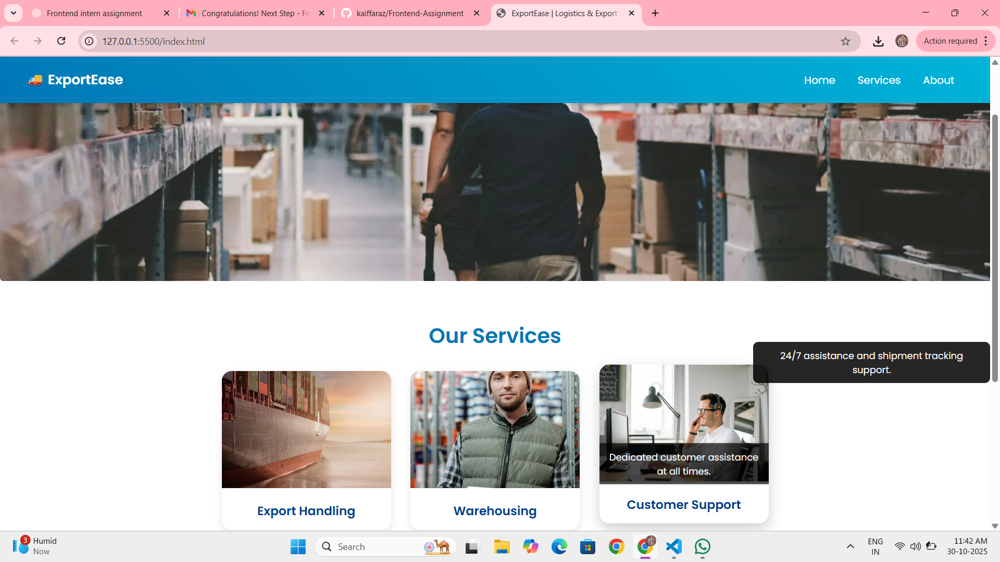
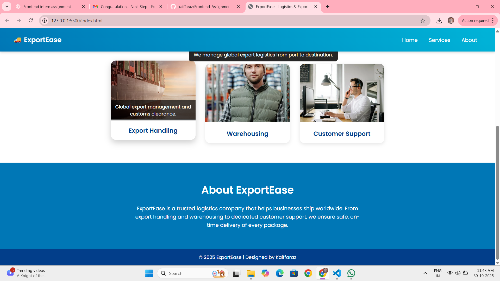

# 🚚 ExportEase – Logistics & Export Solutions 🌍  

A **professional, responsive, and interactive logistics website** built as part of a **Frontend Developer Internship Assignment**.  
The project demonstrates strong frontend design principles with smooth animations, hover effects, auto-scrolling banners, and responsive layouts — offering a clean and engaging user experience.

---

## Project Overview  

**ExportEase** is a logistics and export company website designed to showcase services like **Export Handling**, **Warehousing**, and **Customer Support**.  
The website features a **horizontal image slider** that scrolls automatically every 4 seconds, hover animations, smooth transitions, and a dynamic color-changing About section.  

 The project fulfills all assignment requirements:  
- Image scrolling with animation  
- Hover tooltip popups  
- Color-changing background  
- Attractive, professional UI  
- Fully responsive design  

---

## Project Sections  

### Header / Navigation Bar  
- Fixed header that remains visible during scrolling.  
- Includes smooth anchor links to all major sections.  

### Image Slider  
- Horizontally scrolls **transport-themed images** automatically every 4 seconds.  
- Users can manually scroll left or right as well.  
- Fully responsive for smaller screens.  

### Services Section  
- Displays three primary company services:  
  - **Export Handling**  
  - **Warehousing**  
  - **Customer Support**  
- Includes real, relevant images and hover tooltips describing each service.  

### About Section  
- Color-changing gradient background with smooth animation.  
- Short, professional company description.  

### Footer  
- Simple footer with copyright and author credit.  

---

## Responsiveness  

This website is **fully responsive** using **CSS Flexbox** and **media queries**.  

Tested across:  
-  **Desktop / Laptop**  
-  **Mobile Devices**  
-  **Tablets**  

Layout automatically adjusts for readability and visual balance across all screen sizes.  

---

##  Future Enhancements  

- Add **slider navigation arrows (← →)** for manual control.  
- Include **animated counters** showing shipment statistics.  
- Implement a **contact form** with validation and backend support.  
- Add **dark mode** for better accessibility.  

--- 

##  Author  
**Kaiffaraz**  
B.Tech CSE (AI & ML) | Final Year  Aspiring Frontend Developer & AI Enthusiast     
smdkaiffaraz@gmail.com   
[LinkedIn Profile](https://www.linkedin.com/in/kaiffaraz) 

---

## Project Preview

  

